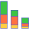
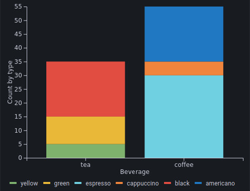

#  Stacked-Barchart

This stacked-barchart Grafana Panel plugin allows you to visualize your data as a stacked barchart.

## Data Constraints

The input data for this panel should be a table of 3 columns with two categorical and one
numerical columns.

For example:

| Group  |  SubGroup  |Count|
|--------|------------|-----|
| tea    | green      |10   |
| tea    | black      |20   |
| tea    | yellow     |5    |
| coffee | espresso   |30   |
| coffee | americano  |20   |
| coffee | cappuccino |5    |

This input data would result in a stacked-barchart that looks similar to:

## Getting started

See [Developer guide](../../../README.md#developer-guide).
